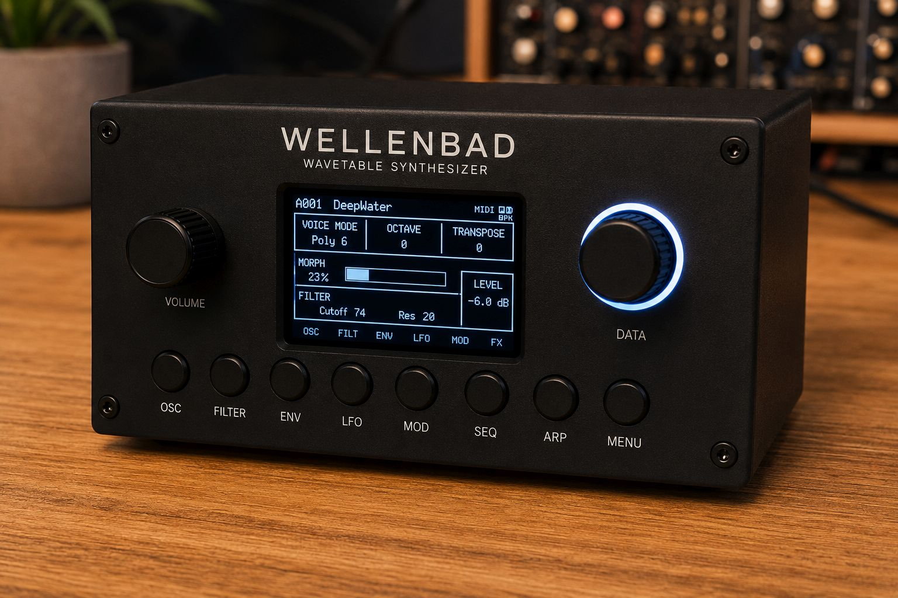
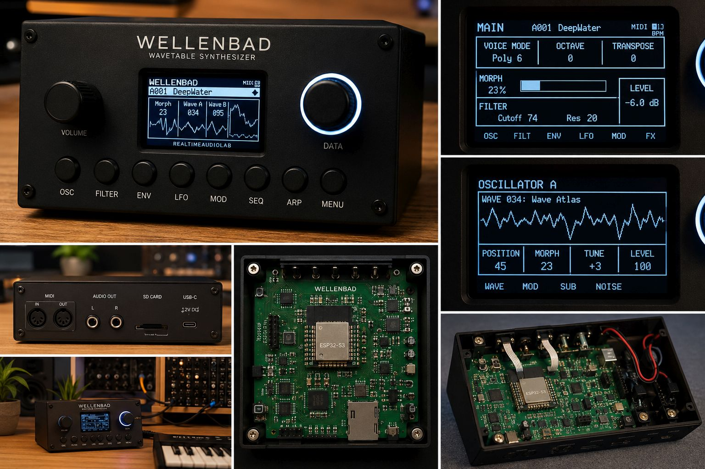

# RTAL-EAI-002-WELLENBAD

## RealTimeAudioLab WELLENBAD
### *A Modern ESP32-S3 Wavetable Synthesizer*

> **An open-source wavetable synthesizer exploring how far modern embedded audio can be pushed using only a handful of affordable components and carefully engineered software.**

Figure 1 - Wellenbad Syntheszier (what it might look like in the future)

---

# Introduction

WELLENBAD is an open-source hardware wavetable synthesizer built around the ESP32-S3.

Its purpose is to demonstrate that a professional-quality digital synthesizer can be created using inexpensive, widely available components and carefully optimized embedded software.

---

# Design Philosophy

## High-End Sound with Minimal Hardware

The project began with a simple engineering challenge:

> **How much synthesizer can be built with as little hardware, as few components and as little financial investment as possible?**

Rather than relying on expensive DSPs or FPGAs, WELLENBAD is intentionally based on only a few affordable modules:

- ESP32-S3
- PCM5102A DAC
- SSD1309 OLED
- MicroSD Card
- MIDI Interface
- Rotary Encoder
- Eight Push Buttons

Every feature is evaluated by:

- Sound quality
- CPU efficiency
- Low latency
- Deterministic real-time behaviour
- Maintainability
- Simplicity

---

# Features

## Synthesis
- Dual wavetable oscillators
- Wavetable Morphing
- Sub Oscillator
- Noise Generator
- SD wavetable loading

## Modulation
- ADSR
- LFO
- Wave LFO
- Velocity
- Mod Wheel
- Aftertouch
- Morph Engine

## Performance
- Polyphony
- Arpeggiator
- Step Sequencer
- Internal / MIDI Clock
- Compare
- Undo
- User Presets

## Audio
- 32-bit DSP
- Soft Limiter
- PCM5102A Stereo DAC

---

# Hardware

| Component | Device |
|-----------|--------|
| MCU | ESP32-S3 |
| Flash | 16 MB |
| PSRAM | 8 MB |
| Display | SSD1309 OLED |
| DAC | PCM5102A |
| Storage | MicroSD |
| MIDI | DIN MIDI |

Figure 2 - Wellenbad Syntheszier Details (what it might look like in the future)

---

# Future Architecture

## Dual ESP32 Design

The next generation separates synthesis and effects:

- ESP32-S3 #1
  - Oscillators
  - Filters
  - Morph
  - Sequencer

↓

Stereo I²S

↓

- ESP32-S3 #2
  - Stereo Delay
  - Chorus
  - Flanger
  - Phaser
  - Reverb

Communication:
- Stereo I²S Audio
- High-speed UART protocol

---

# Roadmap

- ✅ Voice Engine
- ✅ Morph Engine
- ✅ Sequencer
- ✅ Arpeggiator
- ✅ Soft Limiter
- ✅ User Presets
- 🚧 Dual ESP32 FX
- 🚧 Stereo Delay
- 🚧 Stereo Chorus
- 🚧 Stereo Reverb
- 🚧 Flanger
- 🚧 Phaser

---

# Open Engineering

The repository will gradually include:

- Firmware
- Hardware documentation
- KiCad schematics
- DSP architecture
- User manual
- Service manual
- UART protocol

The goal is to share not only the finished synthesizer, but also the engineering decisions behind it.

---

# License

GNU General Public License Version 3

**RealTimeAudioLab**
