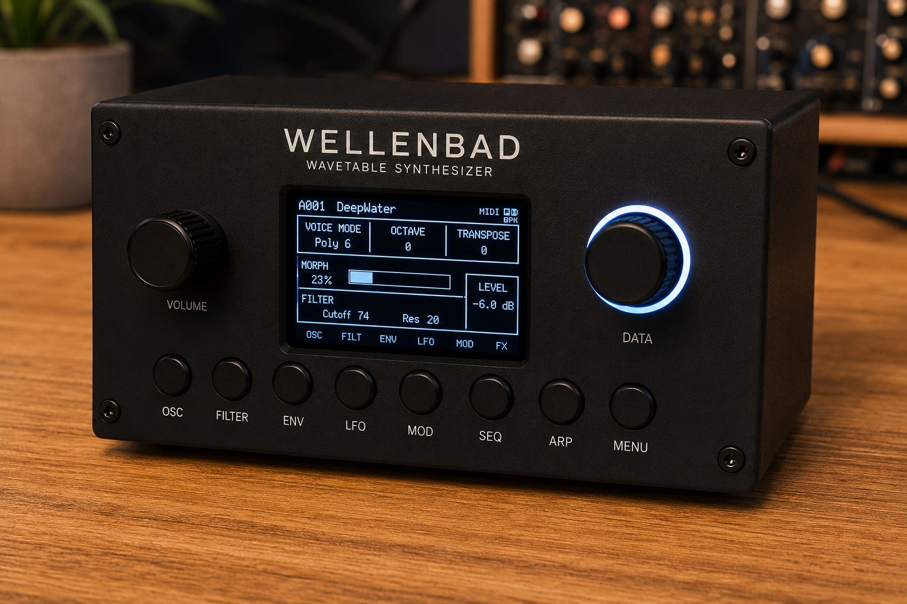
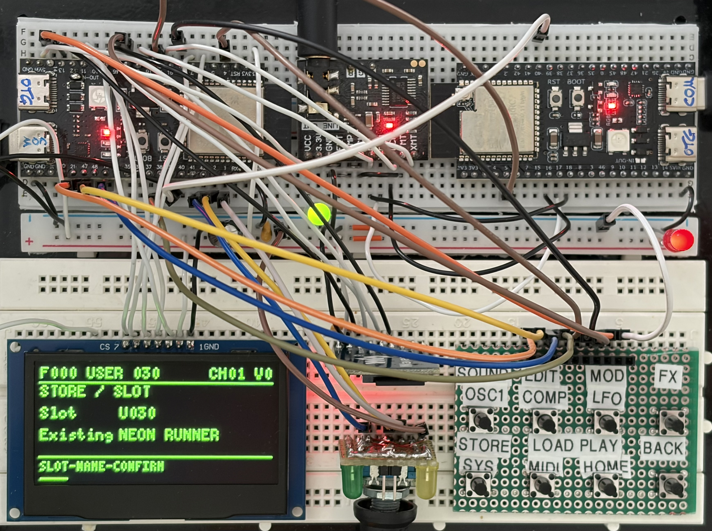
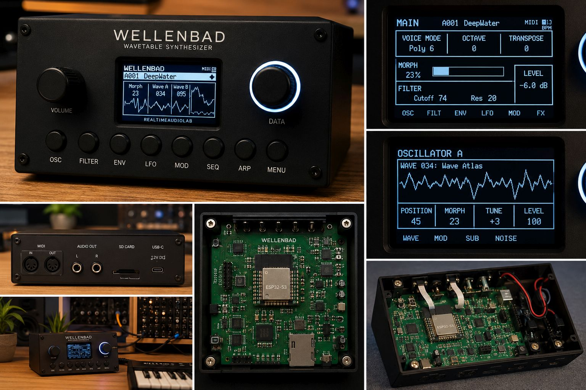

# RTAL-EAI-002-WELLENBAD

# RealTimeAudioLab WELLENBAD

## Embedded Wavetable Synthesis Reimagined

> **An open-source wavetable synthesizer exploring how far modern embedded audio can be pushed using only a handful of affordable components and carefully engineered software.**



## Show Wave Monitor Demonstration

<p align="center">
  
</p>

---

## Project Status

| Area | Status |
|------|--------|
| Firmware | 🟢 Version 1.2 |
| Audio Engine | 🟢 Mature |
| MIDI | 🟢 Complete |
| User Interface | 🟢 Mature |
| Hardware | 🟡 Prototype |
| PCB | 🔵 Planned |
| Dual ESP32 FX | 🟡 Prototype |

---

# Table of Contents

- Introduction
- Engineering Vision
- Project Goals
- Design Philosophy
- Current Prototype
- Feature Overview
- Hardware Platform
- Software Architecture
- Development Timeline
- Future Development
- Future Hardware
- Open Engineering
- Repository Structure
- Acknowledgements
- License

---

# Engineering Vision

WELLENBAD is not simply another DIY synthesizer.

It is an engineering study exploring how far modern embedded audio can be pushed using an affordable ESP32-S3 platform without sacrificing sound quality, usability or maintainability.

The objective is not merely to publish source code, but to document the complete engineering journey.

---

# Introduction

WELLENBAD is an open-source wavetable synthesizer built around the ESP32-S3.

Every hardware revision, firmware milestone and architectural decision is documented as part of the RealTimeAudioLab Engineering Archive.

---

# Project Goals

- High-quality wavetable synthesis on affordable hardware
- Deterministic real-time DSP
- Modular firmware architecture
- Open engineering documentation
- Scalable hardware platform
- Educational reference for embedded audio development

---

# Design Philosophy

> **How much synthesizer can be built using as little hardware, as few components and as little financial investment as possible?**

Every design decision is evaluated according to:

- Sound quality
- CPU efficiency
- Low latency
- Real-time determinism
- Maintainability
- Simplicity

## Why ESP32-S3?

The ESP32-S3 combines floating-point processing, PSRAM support, USB, I²S and excellent cost efficiency, making it an ideal platform for modern embedded audio.

## Why no DSP or FPGA?

WELLENBAD intentionally demonstrates what can be achieved through efficient software engineering before adding hardware complexity.

---

# Current Prototype

The current engineering prototype is fully operational and serves as the primary development platform.

Implemented today:

- Polyphonic wavetable synthesis
- Morph engine
- OLED user interface
- MIDI
- User presets
- Sequencer
- Arpeggiator
- Floating-point DSP



---

# Feature Overview

## Synthesis

- Dual wavetable oscillators
- Morph engine
- Sub oscillator
- Noise generator
- SD-card wavetable loading

## Performance

- Polyphony
- Step sequencer
- Arpeggiator
- MIDI clock
- Compare / Undo
- User presets

## Audio

- Floating-point DSP
- Soft limiter
- PCM5102A DAC

---

# Hardware Platform

| Component | Device |
|-----------|--------|
| MCU | ESP32-S3 |
| Flash | 16 MB |
| PSRAM | 8 MB |
| Display | SSD1309 OLED |
| DAC | PCM5102A |
| Storage | MicroSD |
| MIDI | DIN MIDI |



---

# Software Architecture

```
MIDI
 │
 ▼
Voice Manager
 │
 ▼
Oscillators
 │
 ▼
Morph Engine
 │
 ▼
Mixer
 │
 ▼
Filter
 │
 ▼
DSP Processing
 │
 ▼
Limiter
 │
 ▼
PCM5102A DAC
```

---

# Development Timeline

| Stage | Status |
|------|--------|
| Project Start | ✅ |
| Audio Engine | ✅ |
| Morph Engine | ✅ |
| MIDI | ✅ |
| Sequencer | ✅ |
| User Presets | ✅ |
| Dual ESP32 | 🚧 |

---

# Future Development

## Audio Engine

- DC Blocker
- Soft Saturation
- Oversampling
- Improved Limiter

## Voice Engine

- Voice Priority
- Intelligent Voice Allocation
- Snapshot System

## User Interface

- Dirty-Flag Rendering
- Favorites
- Program History

## Sequencer

- Swing
- Humanize
- Probability
- Parameter Locks

---

# Future Hardware

## Dual ESP32 Architecture

A future hardware generation will separate synthesis and effects processing onto two dedicated ESP32-S3 processors connected through synchronized Stereo I²S audio and a high-speed UART control link.

---

# Open Engineering

Unlike many repositories that publish only firmware, WELLENBAD documents:

- Firmware evolution
- Hardware revisions
- DSP concepts
- Design decisions
- Engineering notes
- Future concepts
- User and service documentation

The goal is to preserve not only the finished instrument, but also the complete engineering process.

---

# Repository Structure

```
doc/
firmware/
images/
schematic/
```

---

# Acknowledgements

Historical inspiration:

- Wolfgang Palm
- PPG Wave

Open-source ecosystem:

- Marcel Licence
- Rolf Degen
- Mutable Instruments
- Craig Barnes
- Open Source Community

---

# License

GNU General Public License v3

---

## RealTimeAudioLab

**Engineering modern embedded audio systems through open development.**
