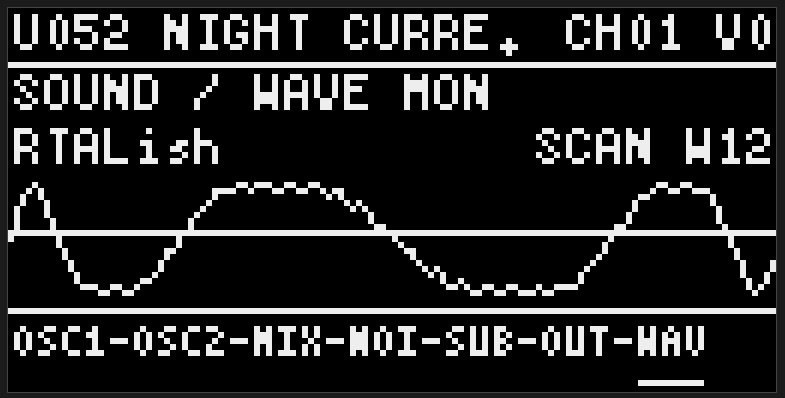
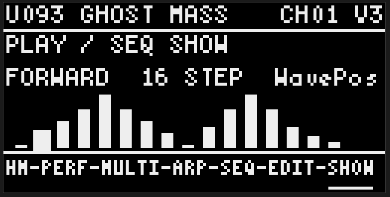
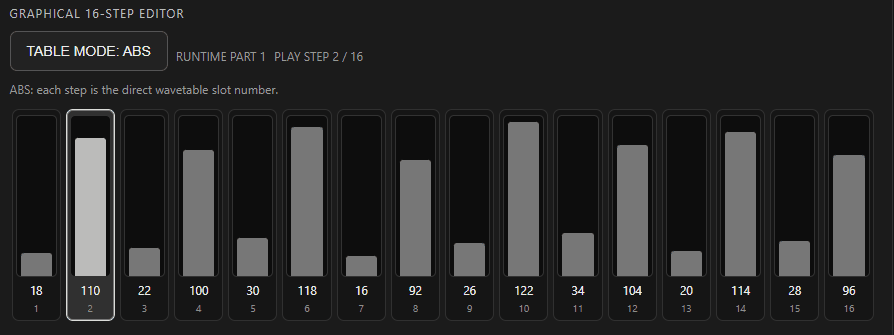

# RTAL-EAI-002-WELLENBAD

# RealTimeAudioLab WELLENBAD

## Embedded Wavetable Synthesis Reimagined

> **An open-source wavetable synthesizer exploring how far modern embedded audio can be pushed using only a handful of affordable components and carefully engineered software.**

---

## WELLENBAD Live Sound Demo 
https://github.com/user-attachments/assets/834537af-4713-4496-9c79-22cb06b83279

---

## Wave Monitor Demonstration

<p align="center">
  
</p>


## Wave Sequencer Demonstration

<p align="center">
  
</p>


## Wave Sequencer PC Editor

<p align="center">
  
</p>

---

**ESP32-S3 Wavetable Synthesizer · 7 Hardware-Validated Voices · 4-Part Multitimbral · Performance Mode · 4-Pole Filter · ARP · Modulation Sequencer · SD Wavetables · MIDI · USB-CDC Editor · OLED**

> **RTAL — Real Time Audio Lab**  
> A compact digital synthesizer built around the ESP32-S3, developed with a strong focus on musical usefulness, deterministic real-time audio and continuous validation on real hardware.

---

## About WELLENBAD

**RTAL WELLENBAD** is an embedded wavetable synthesizer developed as part of **RTAL — Real Time Audio Lab**.

The project explores how far a modern microcontroller can be pushed as a complete real-time musical instrument. Wavetable oscillators, filters, envelopes, modulation, MIDI, arpeggiators, sequencing, preset management, SD-card storage, multitimbral operation, diagnostics and a dedicated hardware user interface all run around a single ESP32-S3 synth engine.

The design philosophy remains deliberately practical:

- high musical value with modest hardware
- deterministic real-time audio processing
- direct hardware control without requiring a computer
- open and understandable firmware architecture
- careful separation of real-time and non-real-time work
- incremental development through real hardware testing
- no hidden “paper specifications”: release limits are based on what the hardware actually sustains

Version **1.5.0** is the largest WELLENBAD update since the published v1.3 release. It consolidates the four-Part multitimbral architecture, introduces a new 4-pole low-pass filter, expands Multi memory, adds a true SINGLE/MULTI performance workflow, extends per-Part routing and adds a USB-CDC remote editor designed not to compromise audio real-time performance.

Firmware identity:

```text
v1.5.0 B0072 A015 FINAL
```

---

# What Changed Since v1.3

The last public release was **WELLENBAD v1.3**. Version 1.5 keeps the core musical concept, but several important subsystems have been redesigned or significantly extended.

| Area | v1.3 | v1.5.0 |
|---|---|---|
| Official polyphony | 8 nominal voices, demanding patches could overrun | **7 hardware-validated voices** |
| Multitimbral Parts | 4 | **4** |
| Voice allocation | Shared dynamic pool | **Shared dynamic 7-voice pool** |
| Filter | Previous resonant filter implementation | **New 4-pole FAST32 biquad LPF** |
| Filter topology | Previous design | **Two cascaded 2-pole stages** |
| Filter cutoff range | parameter mapped | **20 Hz – 18 kHz, 128-point log coefficient table** |
| Filter character | resonance / drive | **Drive before filter + global resonance around the 4-pole structure** |
| Multi slots | 32 (`M00–M31`) | **128 (`M000–M127`)** |
| Multi Part zones | basic Part routing | **Key Low / Key High per Part** |
| Keytrack reference | global/default | **Root Note per Part** |
| Part positioning | existing stereo voice spread | **additional per-Part Pan** |
| Performance workflow | Single/Multi existed in development form | **explicit SINGLE / MULTI Performance Mode** |
| Program Change | program oriented | **mode-aware: Programs in SINGLE, Multis in MULTI** |
| User preset FX | separate / previous behavior | **persistent shared FX state in current user preset format** |
| Multi FX | not part of early Multi format | **one shared persistent FX scene per Multi** |
| Remote editor | not part of published v1.3 | **native USB-CDC editor** |
| Remote real-time protection | — | **CDC SMART SAFE** |
| OLED mirror | hardware only | **browser mirror when real-time reserve permits** |
| Release philosophy | 8 voices with documented edge cases | **7 voices chosen for reliable real-hardware operation** |

The change from 8 nominal voices in v1.3 to **7 official voices in v1.5 is intentional**.

v1.3 already documented that very demanding patches at high sustained polyphony could exceed the 128-frame audio deadline. During the v1.5 development cycle the audio engine, filter, Multi path and editor interaction were extensively tested. The final release therefore publishes the polyphony level that proved reliable in both SINGLE and MULTI operation on the target hardware.

---

# v1.5.0 Highlights

- **7 hardware-validated voices**
- **44.1 kHz** internal audio
- **128-frame** audio blocks
- **4-Part multitimbral** architecture
- dynamic voice sharing across all four Parts
- explicit **SINGLE / MULTI Performance Mode**
- **128 Multi locations** (`M000–M127`)
- protected Factory Programs `F000–F029`
- User Programs `U030–U127`
- new **4-pole FAST32 low-pass filter**
- two cascaded 2-pole biquad stages
- 20 Hz–18 kHz logarithmic cutoff coefficient table
- filter Drive
- global resonance
- independent Program per Multi Part
- independent MIDI channel per Part
- same-channel Part layering
- per-Part volume
- per-Part transpose
- per-Part mute / enable
- per-Part voice reserve
- per-Part ARP gate
- per-Part key zone
- per-Part filter-keytrack root
- per-Part pan
- four independent arpeggiators
- four independent 16-step modulation sequencers
- shared internal / external MIDI master clock
- Multi save / load
- persistent shared FX scene per Multi
- mode-aware MIDI Program Change
- USB-CDC Remote Editor
- **CDC SMART SAFE** real-time protection
- SD wavetable support
- Factory/User preset management
- MIDI CC control and CC Learn
- lightweight real-time diagnostics
- Fast Poly remains disabled in the production release

---

# Architecture

WELLENBAD keeps time-critical synthesis work isolated from user-interface, MIDI, SD and editor work as far as possible.

```text
                       ┌──────────────────────────────────┐
MIDI IN ──────────────►│ MIDI / Control / ARP / SEQ       │
Buttons / Encoder ────►│ UI / Presets / SD / USB Remote   │
USB-CDC Editor ───────►│              Core 0              │
                       └───────────────┬──────────────────┘
                                       │
                                       ▼
                       ┌──────────────────────────────────┐
                       │ Shared 7-Voice Synth Engine      │
                       │                                  │
                       │ WT OSC → ENV → 4-Pole LPF        │
                       │        → PAN / MIX / Audio       │
                       │              Core 1              │
                       └───────────────┬──────────────────┘
                                       │ I2S
                                       ▼
                                  Stereo DAC
```

In MULTI mode:

```text
Part 1 ─┐
Part 2 ─┼──► Dynamic 7-Voice Pool ─► Stereo Mix ─► Output
Part 3 ─┤
Part 4 ─┘
```

The Parts do **not** own fixed groups of voices. All Parts share the same voice pool, allowing polyphony to be used where it is musically needed.

---

# Audio Engine

## Core audio format

| Parameter | v1.5.0 |
|---|---:|
| Sample rate | **44.1 kHz** |
| Audio block | **128 frames** |
| Block deadline | approx. **2.902 ms** |
| Official polyphony | **7 voices** |
| Multitimbral Parts | **4** |
| Wavetable size | **256 samples** |
| Visible wavetable slots | **127** |
| Multi slots | **128** |
| Filter control divider | **4** |
| Filter modulation update rate | **11.025 kHz** |
| Filter audio processing | **44.1 kHz** |

The audio task runs on the dedicated real-time core at high priority.

The heavy development profiler is disabled in the production build.

---

# New 4-Pole FAST32 Low-Pass Filter

One of the most important changes in v1.5 is the replacement of the previous WELLENBAD filter path with a new resource-conscious **4-pole biquad low-pass filter**.

## Topology

The filter consists of two cascaded 2-pole low-pass stages:

```text
Input
  │
  ▼
Drive
  │
  ▼
2-Pole LPF Stage 1
  │
  ▼
2-Pole LPF Stage 2
  │
  ▼
Output
  ▲
  │
Global Resonance Feedback
```

The two stages use different Q values:

```text
Stage 1 Q ≈ 0.541196
Stage 2 Q ≈ 1.306563
```

Together they form the 4-pole response.

## Coefficient strategy

The filter is designed specifically for the ESP32-S3 real-time workload:

- coefficients are precomputed
- **128 logarithmically spaced cutoff positions**
- cutoff range approximately **20 Hz to 18 kHz**
- float32 processing uses the ESP32-S3 FPU
- no `sin()`, `cos()`, `tan()`, `exp()`, `pow()` or `tanh()` calls in the audio render path
- cutoff / envelope control work is updated every 4 audio samples
- actual filtering still runs at the full 44.1 kHz sample rate
- numerator symmetry is used to reduce operations in the biquad implementation
- zero / inactive modulation paths are skipped where possible

The result is a considerably more substantial 4-pole filter character while retaining enough real-time headroom for the final seven-voice configuration.

## Drive and resonance

Drive is applied before the filter stages.

Resonance acts around the complete filter structure rather than as two unrelated resonance controls. This makes the two cascaded stages behave as one musical 4-pole filter rather than simply two independent low-pass filters placed in series.

---

# Wavetable Synthesis

The fundamental WELLENBAD synthesis architecture remains wavetable-based.

Main synthesis functions include:

- dual wavetable oscillator architecture
- wavetable selection
- wavetable position / morphing
- oscillator mix
- oscillator detune
- oscillator B offset
- pitch bend
- sub oscillator
- noise
- amplitude envelope
- filter envelope
- wave envelope
- main LFO
- wave LFO
- velocity modulation
- channel-aftertouch modulation
- filter key tracking
- stereo pan / spread
- Drive
- Bitcrush
- monophonic / polyphonic performance parameters
- glide
- unison detune

WELLENBAD exposes 127 wavetable positions and supports SD-based wavetable content.

Blocking SD access is kept out of the sample render path.

---

# SINGLE and MULTI Performance Modes

v1.5 introduces an explicit Performance Mode.

```text
SINGLE
MULTI
```

The currently selected mode determines how WELLENBAD interprets performance actions such as Program Change and preset selection.

## Hardware shortcuts

| Control | Action |
|---|---|
| T7 / PLAY short | PLAY |
| T7 / PLAY long | **toggle SINGLE / MULTI** |
| T8 / BACK short | BACK |
| T8 / BACK long | **HOME** |

Changing the selected Multi Part does **not** silently change Performance Mode.

---

# SINGLE Mode

SINGLE mode behaves as the normal one-program WELLENBAD performance mode.

A Program controls the complete seven-voice synthesizer engine.

MIDI Program Change selects Programs:

```text
PC 0–29   → Factory Programs F000–F029
PC 30–127 → User Programs U030–U127
```

Factory Programs are protected.

User Programs are stored on SD.

---

# Four-Part MULTI Mode

MULTI mode provides four independent Parts sharing the seven-voice engine.

Each Part contains a complete Program and can be configured with:

- Program
- MIDI channel
- Volume
- Transpose
- Voice Reserve
- ARP Gate
- Key Low
- Key High
- Root Note
- Pan
- Enable
- Mute

## Key zones

v1.5 adds real per-Part MIDI note zones:

```text
KEY LOW
KEY HIGH
```

This makes keyboard splits and restricted layers possible without external MIDI processing.

Example:

```text
Part 1: C1–B2   Bass
Part 2: C3–B4   Pad
Part 3: C5–C8   Lead
Part 4: C1–C8   Layer / texture
```

## Root Note

Each Part also stores a `Root Note`.

This is the zero-reference for filter key tracking, allowing the keytracking response to be musically centered differently for individual Parts.

## Per-Part Pan

A Multi Part can add its own pan offset in addition to the existing voice stereo spread.

This allows a four-Part setup to be spatially arranged as part of the saved performance.

## Same-channel layering

Multiple enabled Parts may listen to the same MIDI channel.

This allows layered performances without a separate layer mode:

```text
Part 1 → MIDI CH 1
Part 2 → MIDI CH 1
Part 3 → MIDI CH 3
Part 4 → MIDI CH 4
```

Parts 1 and 2 will sound together when channel 1 is played.

---

# Multi Memory

v1.3 provided 32 Multi slots.

v1.5 expands this to:

```text
M000 – M127
```

for a total of **128 Multi setups**.

A current Multi stores:

- Multi name
- all four embedded Programs
- Part Program references
- Part MIDI channels
- Part volume
- Part transpose
- Part voice reserve
- Part ARP gate
- Part key zones
- Part Root Note
- Part Pan
- Part enable / mute state
- master clock source
- internal tempo
- one shared persistent FX scene

Embedding the Program data means a saved Multi can restore the sound that belonged to the performance even if an individual Program location is changed later.

## Multi file compatibility

The Multi storage format evolved through several versions.

The v1.5 loader retains support for earlier Multi formats. Older formats receive neutral defaults for fields that did not yet exist, such as later key-zone / Root / Pan or FX data.

Current saves use the latest Multi format.

Legacy v1.3 Multi data therefore remains useful rather than being discarded by the new firmware generation.

---

# Preset Manager

v1.5 formalizes the Program memory into two areas.

## Factory Programs

```text
F000 – F029
```

30 Factory / showcase locations.

Factory Programs are protected against normal User save operations.

## User Programs

```text
U030 – U127
```

98 User locations stored on SD.

User Programs can contain the complete current Program data and, in the current file format, persistent FX state.

The Program browser separates Factory categories and the User area.

Current categories include:

- ALL
- PAD
- LEAD
- BASS
- SEQ
- FX
- ORGAN
- MISC
- USER

---

# FX Architecture

WELLENBAD contains a shared stereo post-mix effects concept.

Because the four Parts are mixed into one stereo bus, the external/shared FX chain is **global to the performance**, not four independent per-Part effect processors.

This design choice is explicit in v1.5:

- a User Program can store persistent FX state
- a Multi stores **one shared FX scene**
- loading a Program into one Part of an active Multi does not unexpectedly replace the complete Multi FX scene

The firmware includes the RTAL control protocol for the companion FX processor and supports parameters for:

- stereo delay
- modulation core
- chorus
- flanger
- phaser
- stereo width
- reverb

Chorus, Flanger and Phaser share one modulation-effects core and are mutually exclusive selections.

The FX preset payload intentionally excludes transient states such as Delay Freeze buffer contents.

---

# Arpeggiators

Every Multi Part has its own arpeggiator.

Available musical parameters include:

- Mode
- Rate division
- Octave range
- Hold
- Gate

All four arpeggiators share the WELLENBAD master clock while maintaining independent note operation.

Clock sources:

```text
INT  — internal tempo
MIDI — external MIDI Clock, 24 PPQN
```

External MIDI Clock may remain continuously present. Transport is controlled with:

```text
FA — Start
FB — Continue
FC — Stop
```

The firmware keeps timing-sensitive MIDI Clock handling separated from lower-priority controller work.

---

# 16-Step Modulation Sequencers

Each Part has an independent modulation-sequencer runtime.

Per-Part sequencer functions include:

- Mode
- Rate
- number of Steps
- modulation Target
- Depth
- Table Mode
- 16 editable step values
- live current-step indication

ARP and SEQ use the same musical timing infrastructure, allowing generated notes and parameter modulation to stay synchronized.

The Remote Editor includes a graphical sequencer interface.

---

# MIDI

WELLENBAD provides hardware MIDI IN and OUT.

Current v1.5 functionality includes:

- Note On / Note Off
- per-Part MIDI channels
- same-channel layering
- Pitch Bend
- Mod Wheel
- Volume / Expression
- Sustain
- Channel Aftertouch
- Program Change
- MIDI CC control
- BANKED CC access
- CC Learn
- MIDI Clock
- Start
- Stop
- Continue
- All Notes Off
- All Sound Off handling

## Mode-aware Program Change

A major v1.5 workflow improvement is that Program Change follows Performance Mode.

### SINGLE mode

```text
PC 0–127 → Program F/U 000–127
```

### MULTI mode

```text
PC 0–127 → Multi M000–M127
```

Multi changes use a protected transition so voices are silenced safely during the setup change.

---

# Editor & Remote Control

One of the most important additions in WELLENBAD v1.5 is the **USB-CDC PC Editor**.

The editor transforms WELLENBAD from a hardware-only synth into a far more efficient sound-design and performance platform.  
It provides direct access to parameters, visualization tools, sequencing functions and system diagnostics — all inside a browser-based interface.

## Why the Editor Matters

The editor makes WELLENBAD faster and easier to use by providing:

- **faster parameter access**
- **better visual feedback**
- **waveform and wavetable activity monitoring**
- **graphical sequencing workflow**
- **remote hardware control**
- **preset and multi management**
- **live diagnostics and communication status**

## Editor Features

The editor provides remote access to major WELLENBAD functions, including:

- oscillator parameters
- filter
- envelopes
- modulation
- performance parameters
- ARP
- graphical SEQ
- clock / system functions
- preset manager
- Multi selection and Part editing
- FX controls
- hardware-button / encoder remote control
- OLED mirror
- link health
- DSP / overrun diagnostics

No network connection is required for the normal USB editor workflow.

---

## Editor Screenshots

### Full Editor Overview


### Wave Monitor


### Graphical Wave Sequencer


### Preset / Multi Management


### OLED Mirror / Hardware Interaction


### Diagnostics / Link Health


---

Official editor:

```text
editor/RTAL_WELLENBAD_Editor_v1.5.0.html
```

---

# CDC SMART SAFE

A conventional “always stream everything” editor caused an important real-time problem during v1.5 development.

Large or frequent USB-CDC transfers could occasionally interfere with the very small 2.902 ms audio-block budget, especially at maximum polyphony.

v1.5 therefore introduces **CDC SMART SAFE**.

The principle is simple:

> Audio timing has priority over editor refresh rate.

When the synthesizer is idle and sufficient real-time reserve exists, the editor receives normal state updates and OLED frames.

While audio is active:

- large OLED mirror transfers are suppressed
- full parameter/state dumps are suppressed
- large Multi / FX / sequencer snapshots are suppressed
- incoming Editor → WELLENBAD control remains active
- only a very small live telemetry packet may be transmitted when enough DSP reserve remains
- if the DSP load becomes too high, even that small telemetry transfer is skipped

After a period of audio inactivity, the full editor state is synchronized again.

This allows the editor to remain useful without allowing screen refresh traffic to take priority over sound generation.

## OLED mirror behavior

Because full OLED frames are deliberately paused during critical real-time operation, the mirrored display may temporarily show the last safe frame while notes are sounding.

The editor intentionally does **not** add a synthetic `V0…V7` voice overlay. This keeps the mirror visually faithful and avoids confusing local graphics that are not part of the physical OLED.

The physical WELLENBAD OLED continues to operate normally.

---

# User Interface

The hardware interface uses:

- SSD1309 128 × 64 OLED
- eight push buttons
- rotary encoder
- encoder push switch

Main pages include:

- OSC
- FILTER
- AMP ENV
- FILTER ENV
- WAVE ENV
- LFO
- PERFORM
- FX
- ARP
- SEQ
- MORPH
- MIDI
- WAVE MON
- PROGRAM
- MULTI / Part editing
- diagnostics / system functions

The firmware also contains the RTAL widget-based UI engine with legacy fallback support.

---

# Hardware

## Main platform

- ESP32-S3
- 16 MB Flash
- 8 MB PSRAM
- SSD1309 128 × 64 SPI OLED
- I2S stereo DAC
- hardware MIDI IN / OUT
- SD card
- 8 push buttons
- rotary encoder + push switch
- native USB connection for the v1.5 Remote Editor

---

# Pin Assignment

The core WELLENBAD hardware assignment remains compatible with the established platform.

| Function | GPIO |
|---|---:|
| MIDI RX | 40 |
| MIDI TX | 39 |
| I2S BCLK | 18 |
| I2S LRCK | 16 |
| I2S DATA OUT | 17 |
| OLED SCK | 12 |
| OLED MOSI | 11 |
| OLED CS | 10 |
| OLED DC | 6 |
| OLED RESET | 7 |
| Button 1 | 21 |
| Button 2 | 47 |
| Button 3 | 45 |
| Button 4 | 38 |
| Button 5 | 4 |
| Button 6 | 15 |
| Button 7 / PLAY | 3 |
| Button 8 / BACK | 14 |
| Encoder A | 1 |
| Encoder B | 2 |
| Encoder switch | 42 |
| SD MISO | 13 |
| SD CS | 9 |

OLED and SD share the SPI clock / data lines used by the hardware design.

## FX control link

The current firmware also contains the RTAL control link for the companion FX processor:

| Function | GPIO |
|---|---:|
| FX Link RX | 8 |
| FX Link TX | 5 |
| Baud rate | 115200 |

This UART carries control, clock/tempo metadata and diagnostics. Audio is transported separately.

---

# SD Card Structure

The firmware uses the established RTAL directories:

```text
/RTALWT        SD wavetables
/RTALPRESETS   User Programs
/RTALBACKUP    backup data
/RTALMETA      metadata
/RTALMULTI     Multi setups
```

Typical current files include:

```text
/RTALPRESETS/U030.RTAL
...
/RTALPRESETS/U127.RTAL
```

and Multi setup files for the `M000–M127` range.

SD-card access and wavetable caching are designed so blocking file operations do not occur in the per-sample audio render path.

---

# Build Environment

The v1.5 release is based on the established WELLENBAD toolchain:

- **Arduino IDE 1.8.19**
- **ESP32 Arduino Core 2.0.16**
- ESP32-S3 target
- PSRAM enabled
- 16 MB Flash target configuration

Open:

```text
WB0072/WB0072.ino
```

in Arduino IDE.

Keep all supplied `.ino`, `.h` and `.cpp` files together in the `WB0072` sketch directory.

---

# Production Configuration

Important production settings:

```cpp
#define SAMPLE_RATE 44100
#define AUDIO_BLOCK 128
#define NUM_VOICES 7

#define RTAL_ENABLE_FAST_POLY 0
#define RTAL_DISABLE_CHORUS_HIGH_POLY 0
#define RTAL_INTERNAL_CHORUS 1
#define RTAL_FILTER_CONTROL_DIV 4
#define RTAL_PROFILER_ENABLED 0
```

The release uses compiler optimization directives:

```cpp
#pragma GCC optimize ("O3")
#pragma GCC optimize ("fast-math")
```

## Fast Poly

`RTAL_ENABLE_FAST_POLY` remains deliberately disabled.

The v1.5 performance target was reached through real DSP-path optimization rather than by re-enabling the retired Fast Poly mode.

---

# Diagnostics

The production firmware retains lightweight diagnostics that are useful during hardware testing and troubleshooting.

Available information includes, depending on the active diagnostic view:

- active voice information
- current DSP time
- maximum DSP time
- audio-block deadline
- overrun count
- MIDI queue activity
- MIDI Clock status
- ARP / SEQ state
- SD status
- wavetable loading status
- heap / PSRAM information
- Remote link health
- FX link state

The detailed development profiler is disabled in the final production build to avoid unnecessary timing overhead.

---

# Real-Time Performance

At 44.1 kHz with 128-frame blocks, WELLENBAD has approximately:

```text
128 / 44100 ≈ 2.902 ms
```

to complete one audio block.

v1.5 was developed around keeping the worst-case musical workload inside this deadline.

## Why seven voices?

The previous v1.3 release advertised eight voices but also documented that demanding patches at 6–8 continuously active voices could occasionally exceed the block deadline.

For v1.5, the release criterion was changed:

> The official polyphony should describe the configuration that is actually reliable on the target hardware.

The final v1.5 configuration therefore uses:

```text
NUM_VOICES 7
```

Seven voices were validated during development in:

- SINGLE mode
- MULTI mode
- demanding 4-pole-filter patches
- operation with the USB Remote Editor using SMART SAFE

This is deliberately more conservative than a nominal “maximum possible” number and better reflects the real-time objective of the project.

---

# Compatibility Notes

## Programs

- Factory Programs remain in the `F000–F029` area.
- User Programs occupy `U030–U127`.
- Current User Program files can include persistent FX data.
- Older User Program formats without FX data load with deterministic safe FX defaults rather than accidentally inheriting an unrelated previous scene.

## Multis

- v1.5 provides `M000–M127`.
- earlier Multi file versions remain readable
- new fields that did not exist in older formats receive neutral defaults
- current saves use the latest Multi format

## Performance Mode

Loading or selecting content is deliberately context-aware:

- normal Program work belongs to SINGLE
- a Part Program can be edited inside MULTI without silently forcing a mode change
- Multi Program Change selects complete Multi setups
- invalid / unavailable Multi loads fail safely instead of leaving a partially changed performance

---

# Development Philosophy

WELLENBAD is not developed as a synthetic benchmark.

Every major generation has been tested as an actual musical instrument, and several v1.5 decisions came directly from real hardware behavior:

- replacing the old filter with a higher-quality 4-pole design
- optimizing the filter until seven voices became practical
- identifying separate SINGLE and MULTI performance costs
- finding USB-CDC traffic as a source of rare audible real-time stalls
- redesigning editor communication around SMART SAFE
- deliberately publishing seven reliable voices rather than retaining an unreliable nominal eight

This iterative process is central to RTAL:

> measure, listen, reproduce, optimize, test again.

---

# Version History

## v1.3

The first published four-Part multitimbral WELLENBAD release:

- nominal 8-voice shared engine
- 4 Parts
- independent ARP / SEQ
- 32 Multis
- per-Part SD wavetable cache
- MIDI / CC Learn
- documented real-time limits at high sustained polyphony

## v1.5.0

Current release:

- 7 hardware-validated voices
- new 4-pole FAST32 biquad low-pass filter
- Drive + global resonance
- optimized seven-voice real-time DSP path
- 128 Multi slots
- explicit SINGLE / MULTI Performance Mode
- mode-aware Program Change
- per-Part Key Low / Key High
- per-Part Root Note
- per-Part Pan
- current User Program format with persistent FX state
- shared persistent FX state in Multi
- native USB-CDC Remote Editor
- graphical sequencer editing
- editor Preset / Multi / FX management
- CDC SMART SAFE real-time protection
- release-oriented cleanup and validation

---

# Release Identity

```text
Product : RTAL WELLENBAD
Version : 1.5.0
Build   : B0072
Series  : A015
Status  : FINAL
```

---

# Repository

RTAL WELLENBAD is part of:

**RTAL — Real Time Audio Lab**

Repository:

`RTAL-EAI-002-WELLENBAD`

The firmware is intended both as a musical instrument and as an open reference for practical real-time audio development on the ESP32-S3.

---

# Notes for Developers

When modifying v1.5, keep the following real-time rules in mind:

1. Do not add SD or filesystem work to the audio path.
2. Avoid expensive transcendental functions inside per-sample rendering.
3. Do not add apparently “small” branches to the hottest sample/voice loops without measuring their effect at seven voices.
4. Keep MIDI Clock handling higher priority than bulk controller work.
5. Keep large USB-CDC state transfers away from active high-polyphony audio.
6. Preserve `RTAL_ENABLE_FAST_POLY = 0` unless a future branch is explicitly created to revisit it.
7. Treat the 2.902 ms block deadline as a hard real-time budget, not an average target.
8. Test SINGLE and MULTI separately: they do not have identical overhead.
9. Validate changes with the Remote Editor both disconnected and connected.
10. Prefer block-rate or control-rate preprocessing when a result does not need to be recalculated per sample.

---

# Acknowledgements

Historical inspiration:

- Wolfgang Palm
- PPG Wave

Open-source ecosystem:

- Marcel Licence
- Rolf Degen
- Mutable Instruments
- Craig Barnes
- Open Source Community

---

# License

GNU General Public License v3

---

## Final Note

WELLENBAD v1.5.0 is a consolidation release.

It does not try to win by quoting the largest possible feature numbers. Instead, it brings the synthesis engine, Multi architecture, filter, preset system and computer editor together into a configuration that has been tuned around the actual limitations of the ESP32-S3.

The result is a compact seven-voice, four-Part wavetable synthesizer with a surprisingly broad performance architecture — built around one inexpensive microcontroller and developed as a real instrument rather than only as a DSP experiment.

**RTAL WELLENBAD v1.5.0 — Real Time Audio Lab**

---

## RealTimeAudioLab

**Engineering modern embedded audio systems through open development.**
